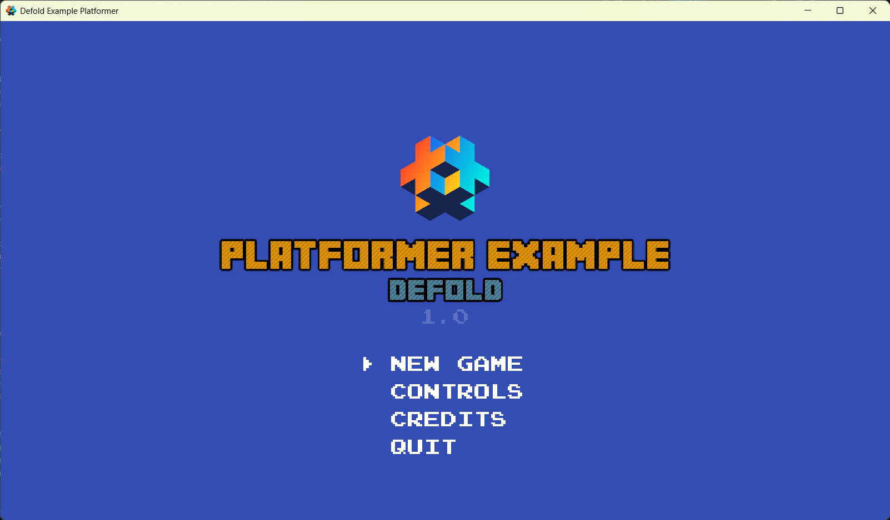
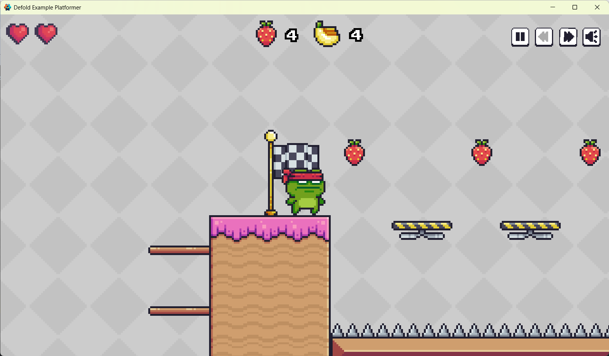
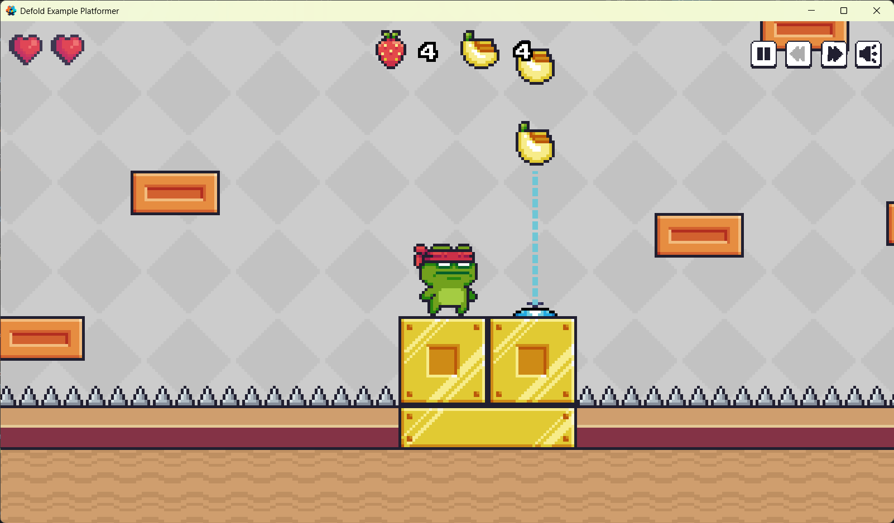
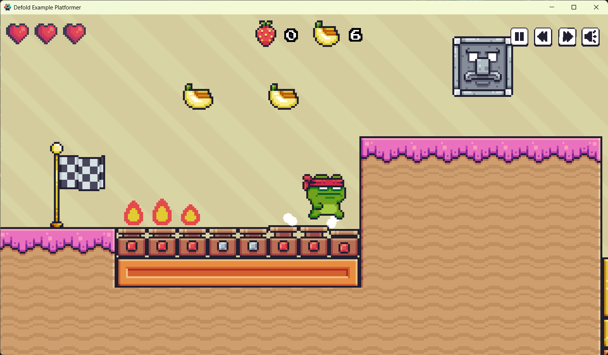
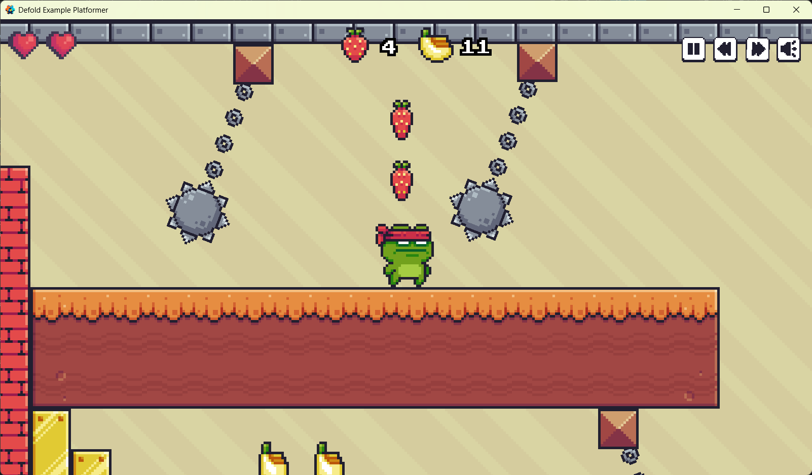
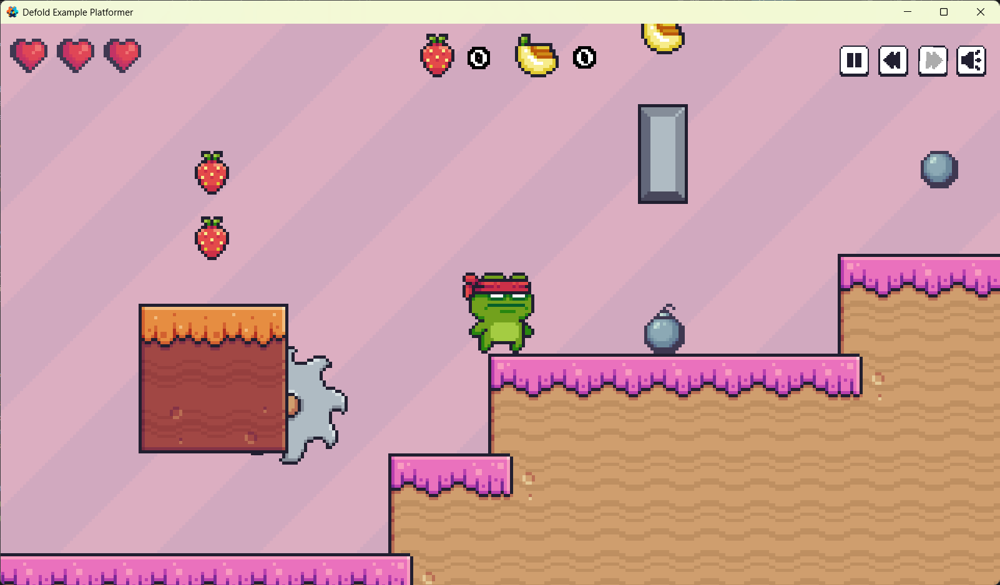
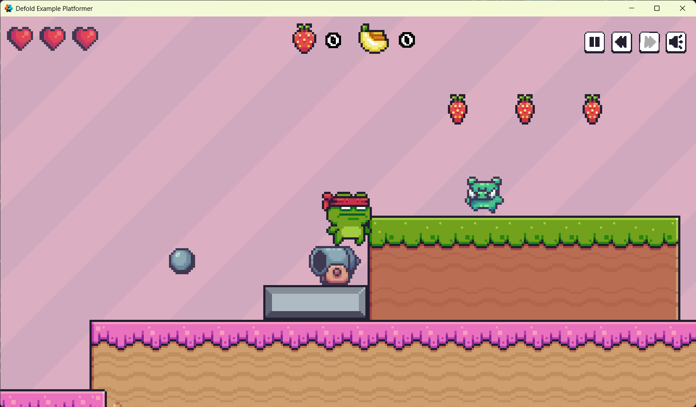
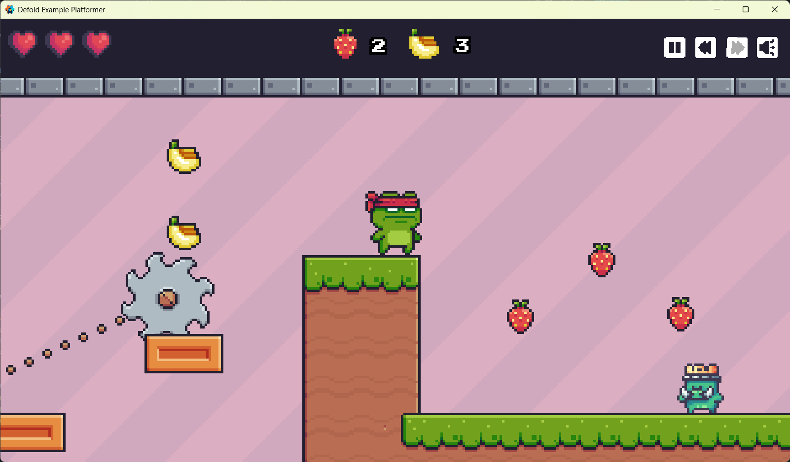

# Defold Example Platformer

A sample 2D pixel platformer for [Defold](https://defold.com/) that goes beyond the basic Defold tutorials. It showcases a variety of platforms, traps, and basic enemies, and
demonstrates how to build a clean, maintainable player controller using the
[Stately](https://github.com/britzl/stately) finite state machine library.  The game also demonstrates how to implement basic UI screens and handles input from keyboard, controller and mouse and mobile touch screens.

## Demo
- [Itch.io](https://parabolink.itch.io/defold-example-platformer)
- [Youtube](https://youtu.be/cDwDfoD7unM?si=BiYaSGlr3tuqDc6_)

## The Game
The game consistis of three small levels. It can be played with keyboard or game controller and the UI also handles mouse control.

### Level 1 — platforming basics
- **Platforms:** Horizontal/Vertical Moving platform, Falling platform, Rotating platform, Spring
- **Traps:** Spikes

### Level 2 — traps
- **Platforms:** Conveyor belt, Falling platform, Spring
- **Traps:** Triggered Fire, Swinging/Rotating spiked ball, 
- **Enemies:** Rock head (patroller)

### Level 3 — enemies
- **Traps:** Path following Saw, Cannon, Trigger Bomb
- **Enemies:** King Pig (chaser), Pig (patroller), Pig in box (jumping patroller)

## Dependencies

### [Stately](https://github.com/britzl/stately)

A small, pure-Lua finite state machine library for Defold by Björn Ritzl. It is
used here to drive the player controller, keeping per-state logic (idle, move,
jump, wall slide, etc.) cleanly separated instead of tangled in one big update
function.

## Artwork
### By Pixel Frog
- https://pixelfrog-assets.itch.io/pixel-adventure-1
- https://pixelfrog-assets.itch.io/kings-and-pigs

## Sound and Music
### Music
https://tallbeard.itch.io/three-red-hearts-prepare-to-dev

### Sound Effects
Most sound effects generated by this cool tool
https://www.bfxr.net/

## Code
The skeleton game code (menus, scene switching, HUD, level loading) is based on
[def-shell](https://github.com/benjames-171/def-shell) by Ben James, though I have made numerous changes to remove unecessary logic from the player controller.  I have also incorporated some coding structure and elements from [defold-daabbcc-example-platformer](https://github.com/selimanac/defold-daabbcc-example-platformer).

Check out [Ben James' GitHub](https://github.com/benjames-171) — it's a wealth
of high-quality, well-documented Defold examples, templates and game jams.